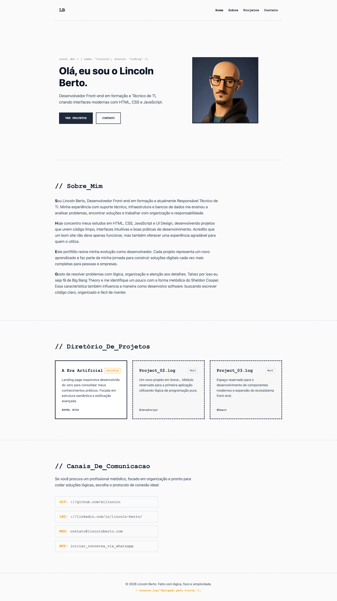

# 💻 Lincoln Berto | Portfólio

Portfólio pessoal desenvolvido para apresentar meus projetos, habilidades e evolução como Desenvolvedor Front-end.

O objetivo deste projeto é reunir meus principais trabalhos, demonstrar boas práticas de desenvolvimento e servir como minha presença profissional na web.

🌐 **Acesse o projeto:** https://lincolnberto.com

---

## 📸 Preview

<p align="center">
  
</p>

---

## 🚀 Tecnologias

- HTML5
- CSS3
- Flexbox
- CSS Grid
- JavaScript (em evolução)
- Git
- GitHub

---

## ✨ Funcionalidades

- Layout responsivo
- HTML semântico
- Navegação por âncoras
- Identidade visual própria
- Estrutura preparada para expansão
- Organização baseada em boas práticas

---

## 📂 Estrutura do Projeto

```text
portfolio/
├── index.html
├── style.css
├── README.md
├── .gitignore
└── img/
    ├── avatar.png
    └── projeto-pic.png
```

---

## 📌 Projetos em Destaque

Atualmente o portfólio reúne meus estudos e projetos práticos.

- ✅ Portfólio Pessoal
- 🚧 A Era Artificial
- ⏳ Novos projetos em desenvolvimento

---

## 🎯 Objetivo

Este projeto faz parte da minha jornada de aprendizado em Desenvolvimento Front-end, servindo como base para apresentar novos projetos, documentar minha evolução técnica e demonstrar minhas habilidades em desenvolvimento web.

---

## 📬 Contato

- 🌐 Site: https://lincolnberto.com
- 💼 LinkedIn: https://www.linkedin.com/in/lincoln-berto/
- 💻 GitHub: https://github.com/eilincoln
- ✉️ E-mail: [contato@lincolnberto.com](mailto:contato@lincolnberto.com)
