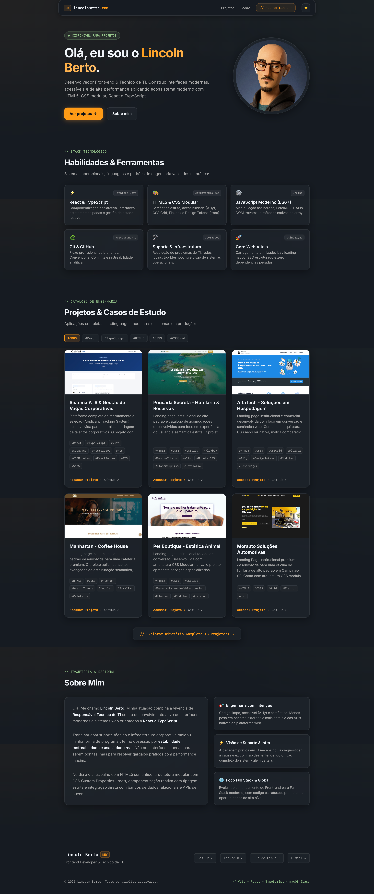

# ⚡ PORTFOLIO V2 — LINCOLN BERTO

> [!NOTE]
> **Engenharia de Interface & Marca Pessoal:** Aplicação Single Page Application (SPA) de alta performance desenvolvida para apresentar minha trajetória, projetos em produção, artigos técnicos e competências em desenvolvimento front-end. O projeto foi construído com arquitetura modular, tipagem estrita de contratos de dados, alternância de temas em tempo real via Design Tokens e deploy contínuo em borda (Edge CDN).

Plataforma desenhada para proporcionar uma navegação fluida, acessível e responsiva em qualquer dispositivo, servindo como hub central para recrutadores, clientes e a comunidade técnica acompanharem minhas entregas de software.

---

## 🌐 Demonstração & Ambientes

- **Domínio Principal:** [https://www.lincolnberto.com.br](https://www.lincolnberto.com.br)
- **Domínio Global (Redirect):** [https://www.lincolnberto.com](https://www.lincolnberto.com)
- **Hub de Links:** [https://links.lincolnberto.com](https://links.lincolnberto.com)

  <table>
    <tr>
      <td align="center" width="60%">
        <b>💻 Experiência Desktop (Dark / Light)</b>  
        
      </td>
      <td align="center" width="40%">
        <b>📱 Navegação & Mobile First</b>  
        
      </td>
    </tr>
  </table>

---

## 🚀 Stack Tecnológica e Decisões de Arquitetura

O projeto foi construído priorizando métricas de Web Vitals, semântica estrita e desacoplamento de responsabilidades:

- **React 18 & TypeScript:** Componentização declarativa, tipagem estática e desacoplamento de regras de negócio em custom hooks.
- **Vite & Pipeline de Produção:** Ferramenta de build ultrarrápida com compilação otimizada, code-splitting nativo e minificação de assets.
- **CSS Modules & Design Tokens:** Estilos com escopo local protegido contra vazamento de especificidade, consumindo variáveis padronizadas no `:root` para espaçamentos, tipografia fluida e cores semânticas.
- **Theming System Nativo:** Mecanismo de alternância instantânea entre Dark Mode e Light Mode com persistência de preferência via `localStorage` e sincronização com as preferências do sistema operacional (`prefers-color-scheme`).
- **SPA Deep Linking & Fallback de Rotas:** Configuração de roteamento cliente via `vercel.json` com regras de reescrita global para evitar erros de 404 em acessos diretos.
- **Infraestrutura em Borda (Vercel CDN):** Hospedagem estática com distribuição global, provisionamento automático de certificados SSL e integração contínua (CI/CD) acionada a cada `git push` na branch `main`.

---

## 📝 Funcionalidades em Destaque

### 🎨 Design System & Interface

- **Header Flutuante Responsivo:** Barra de navegação com acabamento de alto contraste, suporte a ancoragem suave e alternador de tema acessível.
- **Showcase de Projetos:** Catálogo categorizado de aplicações em produção com links diretos para repositórios no GitHub e ambientes de demonstração ativa.
- **Grade de Competências Técnicas:** Visualização estruturada de ecossistemas (Front-end Core, Arquitetura CSS, TypeScript e Ferramental de Build).
- **Acessibilidade (A11y):** Marcação com tags semânticas estritas (`<header>`, `<main>`, `<section>`, `<article>`, `<footer>`), foco navegável por teclado e contraste validado para leitura prolongada.

---

## 👨‍💻 Autor

Desenvolvido por **Lincoln Berto**.

- **LinkedIn:** [https://www.linkedin.com/in/lincoln-berto/](https://www.linkedin.com/in/lincoln-berto/)
- **GitHub:** [https://github.com/eilincoln](https://github.com/eilincoln)
- **Portfólio:** [https://www.lincolnberto.com.br](https://www.lincolnberto.com.br)
